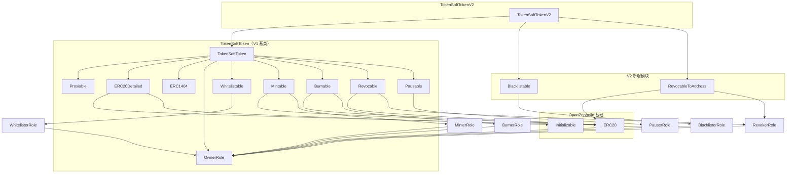
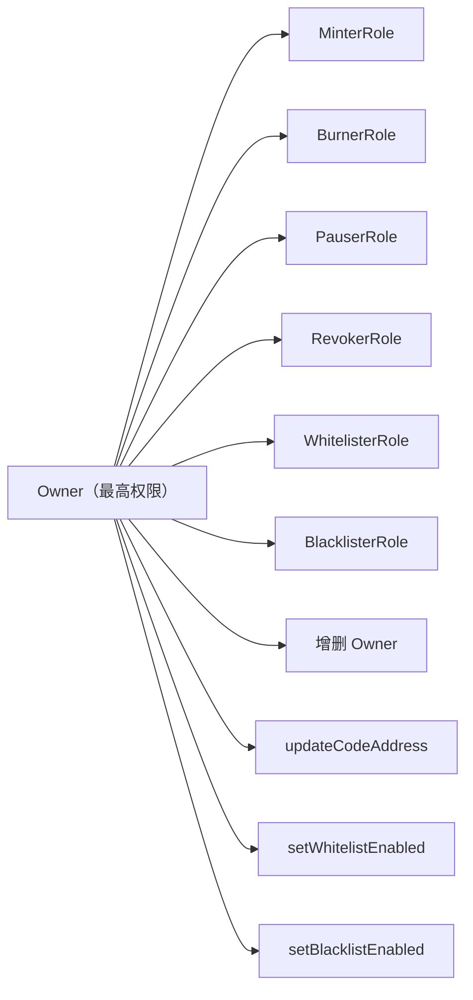

# TokenSoftTokenV2 架构与核心逻辑

## 1. 项目概述

TokenSoft Token 是一个基于 **Solidity 0.6.12** 的 **ERC20 兼容安全代币**项目，在标准 ERC20 转账能力之上实现了 **ERC1404** 转账限制标准。项目采用 **Truffle** 框架开发，依赖 OpenZeppelin Contracts Ethereum Package 提供 ERC20 基础实现与可升级初始化模式。

### 1.1 技术栈

| 组件 | 版本/说明 |
|------|-----------|
| Solidity | 0.6.12 |
| 构建框架 | Truffle 5.x |
| 依赖库 | OpenZeppelin Contracts Ethereum Package |
| 测试 | Mocha + @openzeppelin/test-helpers |
| 升级模式 | EIP-1822 Proxiable + 自定义 Proxy |

### 1.2 目录结构

```
tokensoft_token/
├── contracts/
│   ├── TokenSoftTokenV2.sol      # V2 主合约（当前版本）
│   ├── TokenSoftToken.sol        # V1 基类合约
│   ├── ERC1404.sol               # ERC1404 接口抽象
│   ├── Proxy.sol                 # 代理合约（delegatecall 转发）
│   ├── capabilities/             # 功能模块（Mint/Burn/Pause/Whitelist 等）
│   ├── roles/                    # 角色权限模块
│   └── testing/                  # 测试/示例合约（Escrow 等）
├── test/                         # 单元测试
├── migrations/                   # Truffle 部署脚本
├── scripts/                      # 辅助脚本（生成 Gnosis Safe payload 等）
├── flattened/                    # 扁平化合约（审计用）
└── build/                        # 编译产物
```

---

## 2. 合约继承架构

### 2.1 继承关系图



### 2.2 设计模式

项目采用 **Capability + Role** 的组合模式：

- **Capability（能力模块）**：封装具体业务逻辑与状态（如白名单、黑名单、铸造、销毁）
- **Role（角色模块）**：封装基于 OpenZeppelin `Roles` 库的权限控制，由 Owner 统一管理

所有 Admin 角色（Minter、Burner、Pauser、Revoker、Whitelister、Blacklister）均由 **Owner** 添加/移除，形成中心化但层级清晰的管理结构。

---

## 3. TokenSoftTokenV2 核心逻辑

### 3.1 V2 相对 V1 的变更

| 能力 | V1 (TokenSoftToken) | V2 (TokenSoftTokenV2) |
|------|---------------------|------------------------|
| 白名单限制 | ✅ | ✅（继承） |
| 暂停转账 | ✅ | ✅（继承） |
| 黑名单限制 | ❌ | ✅ **新增** |
| 撤销到任意地址 | ❌（仅 revoke 到自身） | ✅ **新增** `revokeToAddress` |
| 错误码 | 0/1/2 | 0/1/2/**3** |

V2 通过多重继承扩展 V1，**不重写初始化逻辑**，仅在转账限制检测链和 `transfer`/`transferFrom` 层面叠加新规则。

### 3.2 初始化

初始化入口在 V1 基类 `TokenSoftToken.initialize()`：

```solidity
function initialize(
    address owner,
    string memory name,
    string memory symbol,
    uint8 decimals,
    uint256 initialSupply,
    bool whitelistEnabled
) public initializer
```

初始化流程：

1. 设置 ERC20 元数据（name、symbol、decimals）
2. 将全部 `initialSupply` 铸造给 `owner`
3. 将 `owner` 加入 Owner 角色
4. 设置白名单开关 `isWhitelistEnabled`

> 注意：合约通过 Proxy 部署时，构造函数不会执行逻辑合约的 `initialize`，需由部署者在 Proxy 地址上单独调用。

### 3.3 ERC1404 转账限制

ERC1404 要求代币合约提供两个只读接口，供钱包/交易所预先检测转账是否会被拒绝：

| 方法 | 作用 |
|------|------|
| `detectTransferRestriction(from, to, amt)` | 返回限制码，`0` 表示允许 |
| `messageForTransferRestriction(code)` | 返回对应的人类可读错误信息 |

实际转账时，`notRestricted` 修饰符会调用上述检测逻辑，非 0 则 `require` 回滚并附带错误消息。

### 3.4 限制检测优先级（V2）

V2 的 `detectTransferRestriction` 采用 **链式委托** 模式：

```
TokenSoftTokenV2.detectTransferRestriction
    │
    ├─ 1. 黑名单检测 (checkBlacklistAllowed)
    │      └─ 失败 → 返回 FAILURE_BLACKLIST (3)
    │
    └─ 2. 委托 TokenSoftToken.detectTransferRestriction
           │
           ├─ 2a. 暂停检测 (Pausable.paused)
           │       └─ 失败 → 返回 FAILURE_PAUSED (2)
           │
           ├─ 2b. Owner 豁免
           │       └─ from 是 Owner → 返回 SUCCESS (0)
           │
           └─ 2c. 白名单检测 (checkWhitelistAllowed)
                   └─ 失败 → 返回 FAILURE_NON_WHITELIST (1)
                   └─ 通过 → 返回 SUCCESS (0)
```

**关键规则：**

- **黑名单优先于白名单**：即使白名单配置允许，黑名单地址仍无法参与转账
- **Owner 豁免白名单但不豁免黑名单**：Owner 作为 `from` 时跳过白名单检查，但仍受黑名单约束
- **暂停全局生效**：合约暂停时所有转账（含 Owner）均被阻止

### 3.5 错误码定义

| Code | 常量 | 消息 |
|------|------|------|
| 0 | `SUCCESS_CODE` | `"SUCCESS"` |
| 1 | `FAILURE_NON_WHITELIST` | `"The transfer was restricted due to white list configuration."` |
| 2 | `FAILURE_PAUSED` | `"The transfer was restricted due to the contract being paused."` |
| 3 | `FAILURE_BLACKLIST` *(V2)* | `"Restricted due to blacklist"` |

### 3.6 转账执行路径

`transfer` 与 `transferFrom` 在 V2 中显式 override，解决多重继承下的函数选择冲突：

```solidity
function transfer(address to, uint256 value)
    public
    override(TokenSoftToken, ERC20)
    notRestricted(msg.sender, to, value)
    returns (bool success)
{
    return TokenSoftToken.transfer(to, value);
}
```

执行链路：

```
用户调用 transfer / transferFrom
    → notRestricted 修饰符
        → detectTransferRestriction（V2 完整检测链）
        → require(code == 0, message)
    → TokenSoftToken.transfer / transferFrom
        → ERC20.transfer / transferFrom（实际余额变更）
```

---

## 4. 功能模块详解

### 4.1 白名单（Whitelistable）

白名单是 V1 的核心限制机制，支持最多 **255 个白名单组**（ID 1–255，0 保留为"未分配"）。

**状态变量：**

- `isWhitelistEnabled`：全局开关
- `addressWhitelists[addr]`：地址所属白名单 ID
- `outboundWhitelistsEnabled[src][dst]`：源白名单是否允许向目标白名单转账

**默认行为：**

- 所有地址默认属于 whitelist 0（不可收发）
- 所有 outbound 路由默认 **关闭**（包括同组互转），需 Whitelister 显式开启

**检测逻辑：**

```
若 isWhitelistEnabled == false → 允许
若 sender 或 receiver 的 whitelist == 0 → 拒绝
若 outboundWhitelistsEnabled[senderWL][receiverWL] == false → 拒绝
否则 → 允许
```

### 4.2 黑名单（Blacklistable，V2 新增）

**状态变量：**

- `isBlacklistEnabled`：全局开关（默认关闭，需 Owner 启用）
- `addressBlacklists[addr]`：地址是否在黑名单中

**检测逻辑：**

```
若 isBlacklistEnabled == false → 允许
若 sender 或 receiver 在黑名单中 → 拒绝
否则 → 允许
```

**管理接口：**

- Owner：`setBlacklistEnabled(bool)`
- Blacklister：`addToBlacklist(addr)` / `removeFromBlacklist(addr)`

### 4.3 暂停（Pausable）

- Pauser 角色可调用 `pause()` / `unpause()`
- 暂停状态下 `detectTransferRestriction` 返回 code 2，所有转账被阻止
- 部署后默认未暂停

### 4.4 铸造与销毁

| 操作 | 角色 | 方法 | 对总供应量的影响 |
|------|------|------|------------------|
| 铸造 | Minter | `mint(account, amount)` | 增加 |
| 销毁 | Burner | `burn(account, amount)` | 减少 |

初始供应在 `initialize` 时一次性铸造给 Owner。

### 4.5 撤销（Revocable / RevocableToAddress）

| 版本 | 方法 | 行为 |
|------|------|------|
| V1 | `revoke(from, amount)` | 将 `from` 的代币转到 **调用者（Revoker）** 地址 |
| V2 新增 | `revokeToAddress(from, to, amount)` | 将 `from` 的代币转到 **任意指定地址 `to`** |

撤销不改变总供应量，仅变更持有者分布。两种方法均绕过 `notRestricted` 修饰符（直接调用内部 `_transfer`），属于管理员强制操作。

---

## 5. 角色权限体系



| 角色 | 权限摘要 |
|------|----------|
| **Owner** | 管理所有角色成员；开关白名单/黑名单；升级逻辑合约地址 |
| **Minter** | 铸造代币 |
| **Burner** | 销毁任意账户代币 |
| **Pauser** | 暂停/恢复全部转账 |
| **Revoker** | 撤销代币（V1: 到自身；V2: 还可到任意地址） |
| **Whitelister** | 管理白名单成员与 outbound 路由 |
| **Blacklister** | 管理黑名单成员 |

Owner 在转账时享有 **白名单豁免**（可作为 `from` 向任意地址转账），但不享有黑名单和暂停豁免。

---

## 6. 代理升级架构

项目采用 **EIP-1822 Universal Upgradeable Proxy Standard (UUPS 风格)** 的变体实现。

### 6.1 组件

| 合约 | 职责 |
|------|------|
| `Proxy.sol` | 存储逻辑合约地址，通过 `delegatecall` 转发所有调用 |
| `Proxiable.sol` | 提供 `proxiableUUID()`、`getLogicAddress()`、`_updateCodeAddress()` |

### 6.2 存储槽

逻辑合约地址存储在固定 slot：

```
keccak256("PROXIABLE") = 0xc5f16f0fcc639fa48a6947836d9850f504798523bf8c9a3a87d5876cf622bcf7
```

新逻辑合约必须实现相同的 `proxiableUUID()` 返回值，否则升级会被拒绝（`"Not compatible"`）。

### 6.3 升级流程

```
1. 部署新逻辑合约（如 TokenSoftTokenV2）
2. Owner 在 Proxy 地址上调用 updateCodeAddress(newLogicAddress)
3. Proxiable 验证 proxiableUUID 兼容性
4. 更新 storage slot 中的逻辑地址
5. 后续所有调用 delegatecall 到新逻辑合约，状态保持不变
```

### 6.4 部署模式

`migrations/2_deploy_contracts.js` 的部署顺序：

```
1. 部署 TokenSoftTokenV2（逻辑合约）
2. 部署 TokenSoftTokenEscrow（Escrow 逻辑合约，可选）
3. 部署 Proxy，传入逻辑合约地址
4. 通过 Proxy 地址与合约交互（需后续 initialize）
```

---

## 7. 典型使用场景

### 7.1 证券型代币（Security Token）

- 白名单隔离不同投资者群体（如 Reg D / Reg S）
- 黑名单阻止违规账户
- 管理员可强制撤销/销毁不合规持仓
- 监管要求下可暂停全部交易

### 7.2 钱包集成建议

转账前调用：

```solidity
uint8 code = token.detectTransferRestriction(from, to, amount);
if (code != 0) {
    string memory msg = token.messageForTransferRestriction(code);
    // 向用户展示 msg
}
```

### 7.3 白名单配置示例

```
Whitelist A → 仅允许 A → A
Whitelist B → 允许 B → B, B → A
Whitelist C → 允许 C → C, C → A, C → B
Whitelist D → 不允许任何 outbound
```

（参见项目根目录 `example_whitelist.png`）

---

## 8. 安全注意事项

1. **中心化风险**：Owner 及各类 Admin 权限极大（铸造、销毁、撤销、升级），适用于受监管场景而非完全去中心化场景
2. **升级风险**：新逻辑合约必须保持 storage layout 兼容，否则可能导致状态损坏
3. **ERC20 approve 双花**：设置新 approval 前应先置 0（README 已说明）
4. **Proxy 初始化**：部署后须验证 Proxy 指向有效 Proxiable 逻辑合约并完成 initialize
5. **Owner 自移除**：Owner 可以移除自身，需确保至少保留一个 Owner（除非有意放弃管理权）

---

## 9. 测试覆盖

项目测试位于 `test/` 目录，主要覆盖：

| 测试文件 | 覆盖范围 |
|----------|----------|
| `test/TokenSoftToken.js` | 基础代币功能 |
| `test/1404Restrictions.js` | ERC1404 限制码与消息 |
| `test/Transfers.js` | 转账场景 |
| `test/capabilities/Whitelistable.js` | 白名单逻辑 |
| `test/capabilities/Blacklistable.js` | 黑名单逻辑 |
| `test/capabilities/Pausable.js` | 暂停逻辑 |
| `test/capabilities/Mintable.js` / `Burnable.js` / `Revocable.js` | 供应管理 |
| `test/capabilities/RevocableToAddress.js` | V2 撤销到地址 |
| `test/roles/*.js` | 各角色权限 |

运行测试：

```bash
npm install
npm run test
```
